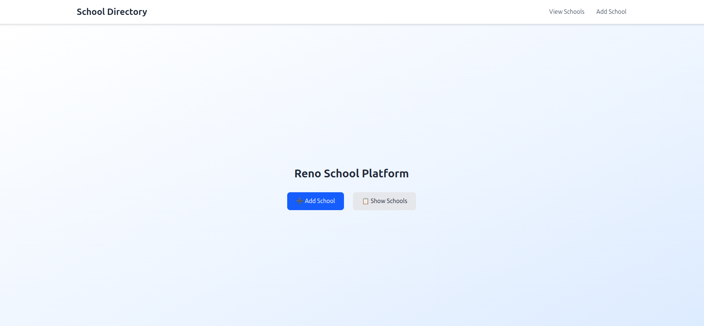
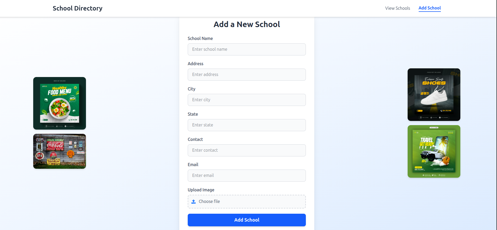
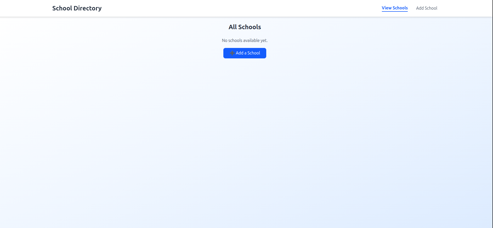

## 🖼️ Screenshots

### Add School Page

### School Directory Page

### Responsive Layout

---

## 🗃️ Database Structure

**Table: `schools`**

- `id` INT AUTO_INCREMENT PRIMARY KEY
- `name` VARCHAR(255)
- `address` TEXT
- `city` VARCHAR(100)
- `state` VARCHAR(100)
- `contact` VARCHAR(20)
- `image` VARCHAR(255)
- `email_id` VARCHAR(255)

---

## ✨ Features

- Add new schools with image upload 📸
- View all schools in a responsive grid 🏫
- Delete schools with one click ❌
- Duplicate prevention for unique entries ✅
- Fully responsive design (desktop & mobile) 📱💻

---

## 🛠 Tech Stack

- **Frontend:** React, Vite, Tailwind CSS, Axios
- **Backend:** Node.js, Express, Multer, CORS, dotenv
- **Database:** MySQL

---

## 🔗 Live Preview

- 🌍 **Frontend:** [Live Demo](https://reno-school-platform-frontend.onrender.com/)
- ⚙️ **Backend API:** [API Endpoint](https://reno-school-platform.onrender.com/api/schools)
- 💻 **GitHub Repo:** [Source Code](https://github.com/snehildwivedi03/reno-school-platform/tree/main)

---

## 📬 Contact

- 📧 **Email:** [snehildwivedi03@gmail.com](mailto:snehildwivedi03@gmail.com)
- 💼 **LinkedIn:** [Snehil Dwivedi](https://www.linkedin.com/in/snehil-dwivedi-/)
- 🐙 **GitHub:** [snehildwivedi03](https://github.com/snehildwivedi03)
- 📱 **Phone:** +91 8303904036
